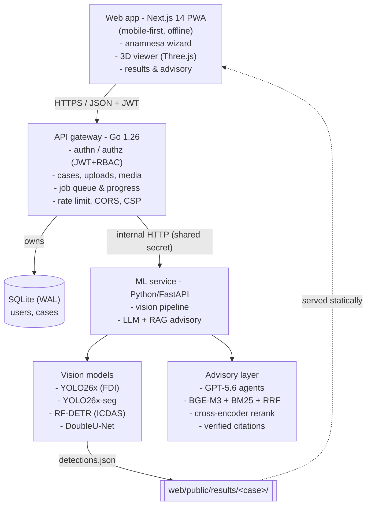
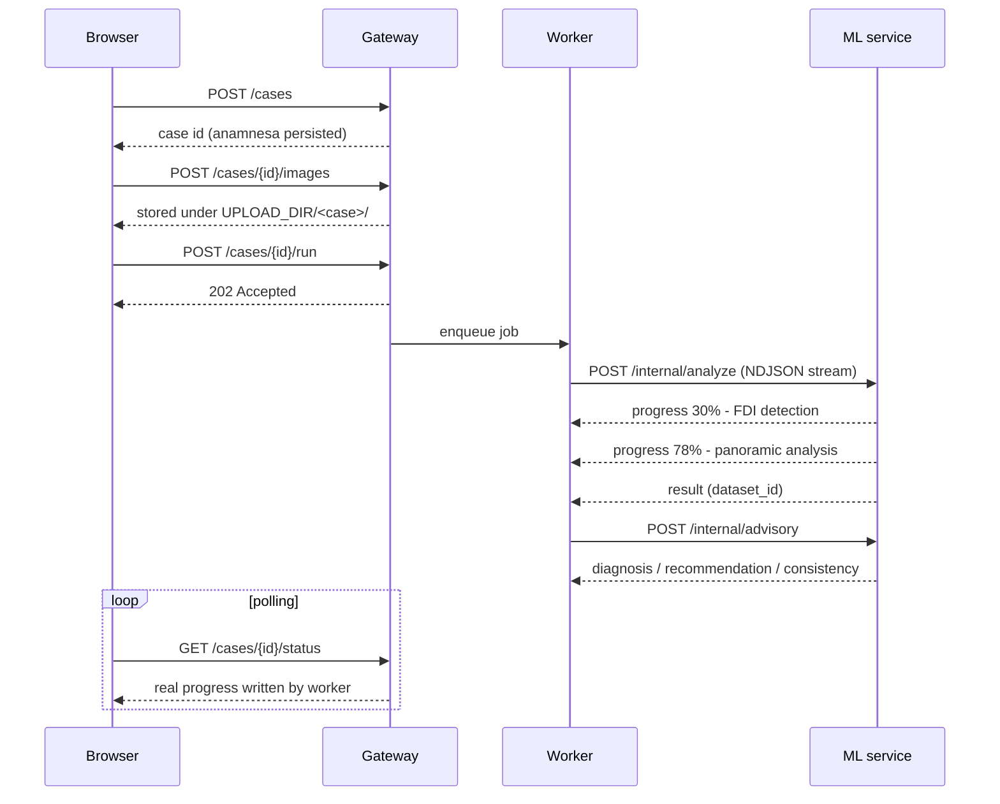
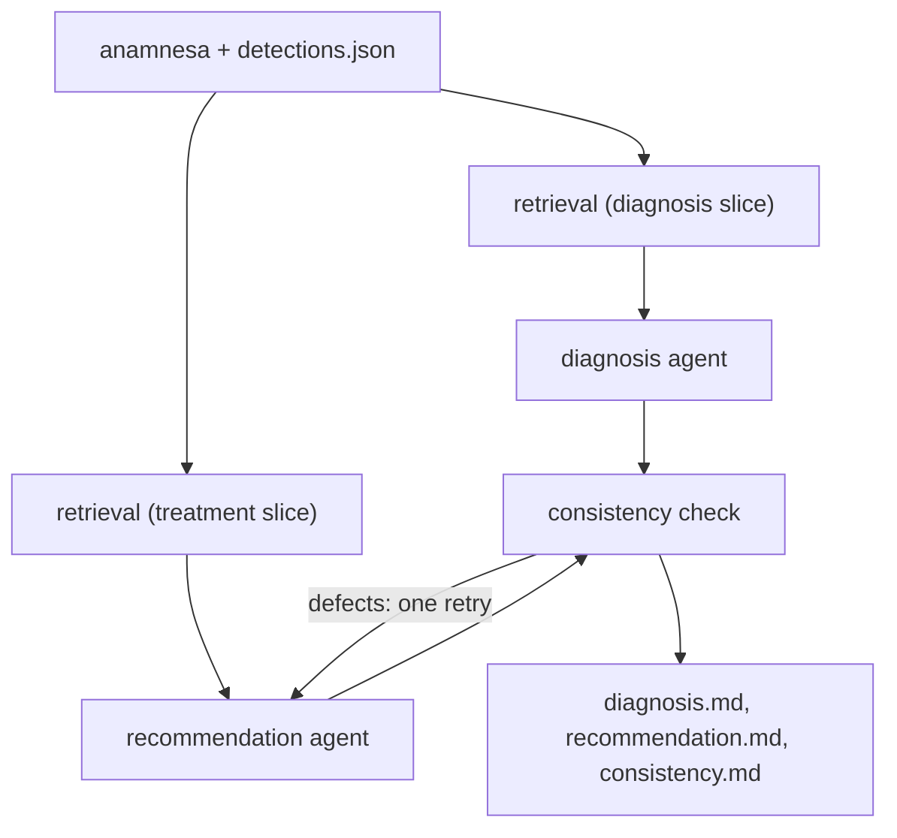

# Architecture

ToothFairy turns a set of ordinary clinic photographs into a per-tooth caries assessment, an
interactive 3D reconstruction of the patient's dentition, and a cited clinical write-up.

This document explains how the pieces fit together and, more importantly, **why** each
boundary is where it is.

---

## 1. System overview



### Why three services and not one

The original prototype was a single Python process. It worked, but every ordinary request
(a login, a history list, a status poll, a thumbnail) was served by the same interpreter that
holds several gigabytes of vision weights and runs CPU-bound inference. That couples two
workloads with completely different shape.

The split follows what each runtime is actually good at:

|              | Go gateway                                 | Python ML service                |
| ------------ | ------------------------------------------ | -------------------------------- |
| Workload     | many short, concurrent, I/O-bound requests | few long, CPU/GPU-bound jobs     |
| Holds state  | yes, the sole database writer              | **no**, fully stateless          |
| Scaling unit | replicas behind a load balancer            | inference workers, GPU-scheduled |
| Restart cost | milliseconds                               | model reload                     |

Concretely, status polling during a 60-second analysis no longer queues behind the analysis
itself, deploying a prompt change does not restart the auth layer, and the ML service can be
moved to a GPU host without touching a line of the request path.

The gateway is not a proxy. It **owns** identity, case records, uploaded media and job
scheduling, while the ML service exposes exactly two operations and remembers nothing between
them.

---

## 2. Request lifecycles

### Creating and running a case



**Why NDJSON streaming rather than polling the ML service.** The vision pipeline runs for tens
of seconds to minutes and knows exactly which stage it is in. Streaming those stages means the
gateway persists _real_ progress instead of animating a fake bar, and neither service has to
keep job state on behalf of the other. A stream that ends without a terminal event is treated
as a failure, so a truncated response can never mark a case "done" with no results.

**Failure containment.** If the advisory call fails, the case still completes, since detection
and the 3D reconstruction already succeeded and are on disk, and discarding them because a text
generation failed would be the wrong trade. The reason is recorded on the case.

### Reading results

`detections.json` and the overlay images are written to `web/public/results/<case>/` and served
**statically by the web app**, not through the API. They are immutable per case, they are the
largest payloads in the product, and the 3D viewer needs them on every frame budget. Serving
them from the app origin means they are cached by the service worker and the viewer works
offline. Patient _photos_, by contrast, go through the gateway's authenticated `/media` route.
See [SAFETY_PRIVACY_SECURITY.md](SAFETY_PRIVACY_SECURITY.md) for details.

---

## 3. Vision pipeline (`ml/inference/`)

A clinic captures up to five intraoral views plus one panoramic radiograph. Any subset works,
and the single-image case is just the degenerate one.

| Model       | Role                                     | Notes                                                                                                    |
| ----------- | ---------------------------------------- | -------------------------------------------------------------------------------------------------------- |
| YOLO26x     | FDI tooth numbering (intraoral)          | low confidence threshold on purpose, since a badly decayed crown scores low but still needs its FDI slot |
| YOLO26x     | FDI tooth numbering (panoramic)          | CLAHE-preprocessed to match its training distribution                                                    |
| YOLO26x-seg | tooth / caries / cavity / crack polygons | supplies lesion _shape_ and which crown region is affected                                               |
| RF-DETR-2XL | ICDAS D1-D6 severity grading             | a reliable severity **floor**                                                                            |
| DoubleU-Net | panoramic caries segmentation            | finds lesions invisible in photographs                                                                   |
| YOLO26x-seg | per-tooth silhouettes (panoramic)        | drives per-patient 3D tooth shape and root curvature                                                     |

**Fusion** (`ml/inference/fuse.py`) merges every view's evidence onto the same FDI teeth,
keeping the strongest evidence per tooth, and resolves the interesting cases:

- **Severity** is `max(grader, image evidence)`. The grader under-calls some grossly destroyed
  teeth, so segmentation area plus an _exposure-invariant_ darkness measure (lesion luminance
  relative to healthy enamel across the whole arch) is allowed to raise the grade. Referencing
  the arch rather than the tooth's own enamel keeps the measure valid when a tooth is almost
  entirely destroyed, and makes it robust across lighting.
- **Hidden lesions.** A tooth flagged only by the panoramic is an internal lesion under intact
  enamel, carved differently in 3D and never coded as an enamel-only lesion.
- **Missing teeth** are declared only when _both_ detectors agree, and only when a panoramic
  was supplied. Otherwise, "absent" cannot be told apart from "not in this view".
- **Teeth in no uploaded view stay healthy** unless the panoramic says otherwise. Silence is
  not evidence of disease.

The output is `detections.json`, containing per-tooth severity, evidence sources, lesion
positions and sizes, photo-sampled colours, and a unit-free shape descriptor.

---

## 4. 3D reconstruction (`web/components/three/`)

Each tooth is three nested solids (enamel, dentine, pulp) built by inward normal-offset of a
real tooth surface, so the pulp naturally forms horns under the cusps and canals in the roots.

Nothing is baked. Both the **shape morph** (per-patient length, width and root curvature from
the panoramic silhouettes) and the **caries carve** run at runtime from `detections.json`, so a
new patient simply re-morphs and re-carves, with no asset rebuild.

The carve follows the ICDAS scale, where D1-D2 do not cavitate (the tooth stays white), D3
breaks through the thin enamel into dentine, and D5-D6 grind the crown to a stump exposing a
dentine ring and pulp. Lesion colours are sampled from the actual photograph, so a brown molar renders
brown. A cross-section examiner slices any single tooth to show layer involvement.

---

## 5. Advisory layer (`ml/app/llm/`)



### Two retrievals, not one

The diagnosis agent needs symptom, severity and epidemiology evidence, while the recommendation
agent needs treatment guidelines. Sharing one retrieval would let one agent's evidence crowd out
the other's in a small top-N, so each gets its own query against its own corpus slice.

Retrieval is **contextual + hybrid + reranked**, using paragraph-packed chunks each prefixed at
ingest with a one-sentence blurb situating it in its document, dense BGE-M3 and sparse BM25
fused by reciprocal rank, and a cross-encoder that reranks the shortlist down to six passages.
The embedder and reranker are open-weight models that run **locally**, so no patient-derived
query text leaves the machine during retrieval.

### Per-tooth analysis (`toothprofile.py`)

The failure mode this design exists to fix is that, given only `(tooth, grade)`, a model
correctly writes "same as above" for every tooth of the same grade, producing a table of `Idem`
that reads as if nobody looked.

But the detector already knows much more per tooth. `toothprofile.py` distils it into a
quantitative profile, including lesion extent as a share of the crown, discolouration relative
to sound enamel, how many separate lesions and where in the crown they sit, whether the
panoramic corroborates, how many detectors agreed, and the tooth's anatomical name. Every band
is a documented cut-off, so the descriptors are reproducible and unit-tested.

With that in the prompt, a per-tooth answer becomes the path of least resistance. The template
then demands a distinct damage pattern per row, a narrative paragraph for the priority teeth,
and an explicit section correlating findings with the patient's own complaint, including which
detected lesions the patient never mentioned. The consistency checker rejects `Idem`-style
filler outright, and the evals measure the share of distinct damage-pattern cells.

### Verified citations (`citations.py`)

The agent may cite the retrieved passages, but its word is not taken for it. Each claimed quote
is checked as a **verbatim substring of the document it is attributed to**, and quotes that
cannot be found are dropped _along with their marker_, so a fabricated citation degrades to no
citation rather than to a false one. The verified/rejected counts are reported by the evals as a direct
hallucination signal.

### Deterministic consistency check

The final node is **not** a model call. A guard on a clinical output must not itself be able to
hallucinate an approval, so it checks that every affected tooth appears in both documents, no
treatment is planned for a tooth both detectors call absent, every ICD-10 code comes from the
sanctioned table, pulp codes only appear on deep lesions, and no row repeats another. Defects it
can fix are fed back into exactly one recommendation retry, and the retry is told _what_ to fix,
not merely asked to try again.

### Graceful degradation

`LLM_ENABLED=0`, no API key, a rate limit, a network blip, or a truncated response all lead to
the same place, a deterministic stub built from the detections. The test suite and the offline
demo always run that path, so **no test ever makes a network call**.

---

## 6. Repository layout

```
web/        Next.js 14 PWA: anamnesa wizard, 3D viewer, results, advisory cards
gateway/    Go API gateway: auth, cases, uploads, media, job queue
ml/         Python service
  app/        FastAPI internal API + LLM/RAG advisory layer
  inference/  vision pipeline (detection -> fusion -> overlays -> 3D inputs)
  training/   one empty folder per model, where the downloaded weights land
  evals/      retrieval + generation evaluation harness
assets/
  samples/    three demo captures + a single-view case
  seed/       demo accounts, cases and committed advisory output
  3d/         base dentition mesh
  blender/    asset-generation scripts for the layered teeth and gingiva
docs/       this document, safety notes, model/dataset links, eval report
```

---

## 7. Testing

| Suite      | Command                       | Covers                                                                                    |
| ---------- | ----------------------------- | ----------------------------------------------------------------------------------------- |
| Go         | `cd gateway && go test ./...` | auth, JWT forgery, RBAC, uploads, path traversal, rate limiting, job lifecycle, store     |
| Python     | `cd ml && python -m pytest`   | agents, prompts, citations, per-tooth profiles, consistency rules, internal API, adapters |
| Web unit   | `cd web && npm run test:run`  | API client, forms, result components, markdown rendering                                  |
| End-to-end | `cd web && npm run e2e`       | the real three-service stack in a mobile viewport                                         |

The E2E suite boots the **actual** gateway and ML service (in mock-inference mode) rather than
stubs, so it exercises the auth, upload and polling path the product ships with.

---

## 8. Deployment notes

- The gateway and the ML service must share a filesystem for `UPLOAD_DIR` (the gateway writes
  photos, the ML service reads them) and `RESULTS_DIR` (the ML service writes results, the web
  app serves them). In containers that is one volume each, and `docker-compose.yml` wires both.
- Only the gateway should be publicly reachable. The ML service belongs on a private network
  and additionally requires `INTERNAL_API_KEY` on every call.
- `ENV=production` makes the gateway refuse to start with a development JWT secret or a missing
  internal key, so a misconfigured deployment fails loudly instead of quietly serving forgeable
  tokens.
- SQLite with WAL is sufficient for a clinic-scale workload and keeps operations trivial. The
  store is a narrow interface, so moving to Postgres is a driver change, not a rewrite.
